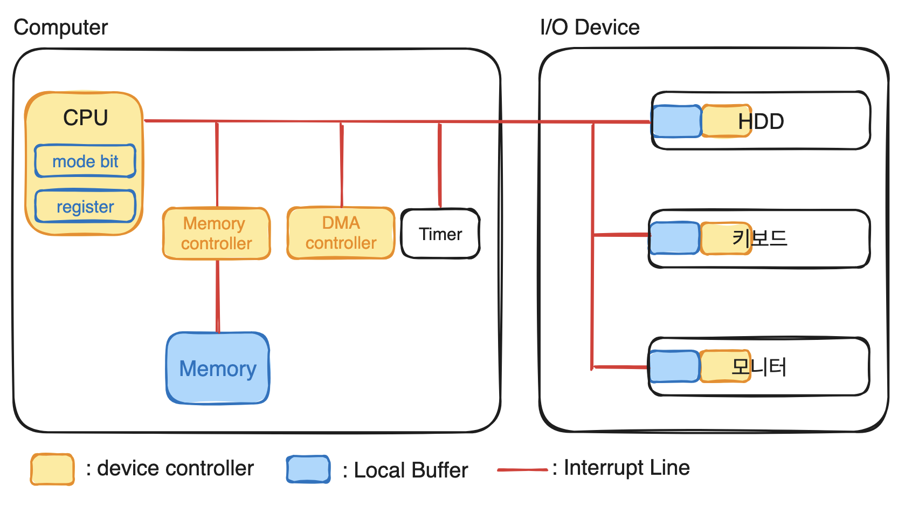

# System Structure & Program Execution

## Device Controller

- 디바이스를 전담하는 작은 CPU로 디바이스의 내부를 통제한다.
- 작업에 필요한 정보( 명령 )를 register 에 저장한다.

## Local Buffer

- cpu 의 작업공간이 memory 인 것처럼 device controller 의 작업 공간

## Interrupt Line

- CPU 에게 신호를 보내 인터럽트를 발생시키는 라인이다.
    - 사용자 프로그램이 OS에게 I/O 작업을 요구하는 Interrupt 발생
    - I/O Device 가 작업의 결과를 전달하기 위한 Interrupt 발생
- CPU 가 하나의 명령의 실행을 완료할 때마다 라인을 감지한다.
    - 인터럽트의 번호를 읽는다.
    - 인터럽트 벡터의 인덱스로 사용하여 인터럽트 핸들러 루틴으로 점프한다.
- CPU는 I/O Device 에 직접 접근하지 않고 메모리에만 접근하여 작업을 한다.

## Mode Bit

- CPU 에서 실행되는 프로세스가 OS 인지 사용자 프로그램인지 구분하는 값
    - 1 : 사용자 프로그램으로 제한된 명령만 호출이 가능하다.
    - 0 : OS 코드를 수행하는 커널 모드로 모든 명령 호출이 가능하다.
        - I/O Device 접근
        - 메모리 공간 접근

## Register

- 프로세스 실행을 위한 정보를 저장할 수 있는 CPU 내부에 있는 작은 공간
- Memory 보다 속도가 더 빠르다.

## Timer

- 특정 프로그램이 CPU 를 독점하는 것을 막기 위한 하드웨어
    - 사용자 프로그램에게 CPU를 넘겨줄 때 타이머를 설정하여 넘겨준다.
    - 타이머 값이 0이 되면 interrupt 를 생성하여 CPU 가 이를 확인한다. 이를 통해 다음 프로그램에게 CPU를 넘겨준다. ( CPU time sharing )

## DMA controller

- CPU 말고 메모리에 접근할 수 있는 하드웨어이다. CPU 대신 I/O Device 의 로컬버퍼에 있는 데이터를 메모리에 복사한다.
- CPU가 메모리에 I/O 디바이스의 로컬 버퍼에서 데이터를 복사할 때 생성되는 interrupt 가 너무 많아 CPU 가 효율적으로 사용될 수 없다.

## Memory Controller

- 메모리에 대한 접근을 동기화한다.
