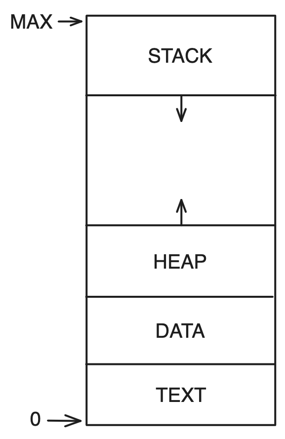

# 프로세스 개념
## 프로세스
실행 파일이 메모리에 적재될 때 프로세스가 되며 실행중인 프로그램을 뜻합니다.

- **프로세스는 능동적인 존재이다.**
- 프로세스 현재 상태를 나타내는 값
	- 프로그램 카운터 값 : 다음에 실행할 명령어의 위치를 가르키는 값
	- 프로세스 레지스터 : 프로세스를 실행하며 필요한 여러 정보
- 두 프로세스가 동일한 프로그램에 연관될 수 있지만 두개의 별도의 실행 순서로 간주합니다.
---
### **프로세스 메모리 배치**

- TEXT 섹션 : 실행 코드
- DATA 섹션 : 전역 변수
- HEAP 섹션 : 프로그램 실행 중 동적으로 할당되는 메모리 공간
- STACK 섹션 : 함수 호출시 사용되는 임시 데이터 저장 장소
	- 함수 호출시 활성화 레코드가 스택에 푸시 된다.
	- 매개변수, 복귀 주소, 반환 값, 지역변수 등등

| 메모리 영역 | 크기가 고정됨 |
| :-: | :-: |
| TEXT | O |
| DATA | O |
| HEAP | X |
| STACK | X |  
**STACK, HEAP 영역이 서로의 방향으로 커지더라도 운영체제에서 서로 겹치지 않도록 해야한다.**

---
- **프로세스 자체가 다른 개체를 위한 실행 환경으로 동작할 수 있다.**
	- Java 프로그램은 JVM 안에서 실행된다.
		<aside>
		💡 JVM 이란 Java 코드를 해석하고 코드를 대신하여 기계어를 이용하여 행동을 취하는 프로세스이다.
		</aside>

### 프로세스 상태
프로세스는 실행되면서 상태가 변하는데 이는 부분적으로 프로세스의 현재의 활동에 따라 정의된다. 상태의 종류와 이름은 운영체제마다 다르다.

| 상태명 | 설명 |
| --- | --- |
| New | 프로세스 생성 중 |
| Ready | 프로세스가 처리기에 할당되기를 기다린다. ( CPU 자원 할당 대기 ) |
| Running | 프로세스 명령어 실행 중 |
| Waiting | 프로세스가 이벤트를 기다린다. ( I/O 작업 완료, 신호의 수신 ) |
| Terminated | 프로세스의 실행이 종료 |
- 한 처리기 코어에서 한순간에는 오직 하나의 프로세스만 실행되지만 많은 프로세스가 준비 및 대기 상태에 있을 수 있다.
### 프로세스 제어 블록 ( PCB )
프로세스 제어 블록은 프로세스를 시작시키거나, 다시 시작시키는데 필요한 모든 데이터를 위한 저장소 역할을 한다.  

| 데이터 종류 | 설명 |
| --- | --- |
| 프로세스 번호 ( PID ) | 프로세스가 가진 고유한 번호 |
| 프로세스 상태 | 프로세스의 상태 값 |
| 프로세스 카운터 | 프로세스가 다음에 실행할 명령어의 주소 |
| CPU 레지스터 | 프로세스의 정보들을 저장한다. |
| CPU 스케쥴링 정보 | 프로세스 우선순위, 스케쥴 큐에 대한 포인터, 스케쥴 매개변수 |
| 메모리 관리 정보 | 페이지 테이블 정보, 세그먼트 테이블 정보, base 레지스터, limit 레지스터 값 |
| accounting 정보 | CPU 사용시간, 경과된 시간, 시간 제한, 계정 번호 |
| 입출력 상태 정보 | 프로세스에 할당된 입출력 장치, 열린 파일 목록 등등 |
- CPU 레지스터는 컴퓨터의 구조에 따라 다양한 수와 유형을 가진다.
- CPU 레지스터는 프로세스가 다시 스케쥴 될 때 계속 올바르게 실행되도록 하기 위해 인터럽트 발생시 저장되어야 한다.
### 스레드
현대 운영체제는 프로세스 개념을 확장하여 한 프로세스가 다수의 실행 스레드를 가질 수 있도록 한다.
- 스레드를 지원하는 시스템에서 PCB 는 스레드에 관한 정보를 포함하도록 확장된다.
- 프로세스가 한번에 하나 이상의 일을 수행할 수 있다.
- 여러 스레드가 병렬로 실행될 수 있다.
# 프로세스 스케쥴링
CPU 이용을 최대화하기 위해 항상 어떤 프로세스가 실행되도록 하게 하며 각 프로그램이 실행되는 동안 사용자가 상호 작용할 수 있도록 프로세스들 사이에서 CPU 코어를 빈번하게 교체한다.
- 준비 큐에 있는 프로세스 중 하나의 프로세스에게 CPU 코어를 할당한다.
- 다중 프로그래밍 및 시간 공유의 목표를 균형 있게 유지하기 위해서 프로세스의 일반적인 동작을 고려해야 한다.

**프로세스의 일반적인 동작의 종류**

| 프로세스 동작 | 설명 | CPU 필요 시간 |
| --- | --- | --- |
| I/O 바운드 프로세스 | 계산보다 I/O 에 더 많은 시간을 소비하는 프로세스 | I/O 요청 대기 전 짧은 밀리초 |
| CPU 바운드 프로세스 | 계산에 더 많은 시간을 소비하는 프로세스 | 오랜 시간 |
**스케줄링 큐의 종류**

| 스케쥴링 큐 | 설명 |
| --- | --- |
| 준비 큐 | 프로세스가 시스템에 들어가서 준비 상태로 CPU 코어의 할당을 기다리는 큐 |
| | 일반적으로 연결 리스트로 저장된다. |
| | 헤더에 첫번째 PCB에 대한 포인터가 저장된다. |
| | PCB에는 준비 큐의 다음 PCB 를 가리키는 포인터 필드가 포함되어 잇다. |
| 대기 큐 | I/O 작업이 가능할 때까지 대기하는 큐 |
| | 프로세스가 자식 프로세스를 만든 다음 자식의 종료를 기다리는 동안 들어갈 수 있다.. |
- 프로세스는 종료될 때까지 `프로세스 대기 상태 → 준비 상태 → 준비 큐 진입` 주기를 반복한다.

  

## Context Switch ( 문맥 교환 )
CPU 코어를 다른 프로세스로 교환하기 위해 이전 프로세스의 상태(문맥)를 보관하고 새로운 프로세스의 보관된 상태(문맥)를 복구하는 작업
- 문맥 교환 시간은 메모리의 속도, 저장, 복구 되어야 하는 레지스터의 수와 특수 명령어에 의해 좌우된다.
- 문맥 교환 동안은 시스템은 아무런 유용한 일을 하지 못하기에 순수한 오버헤드이다.
- 문맥은 프로세스의 PCB에 표현된다.
### Context Switching 과정

# 프로세스 연산
대부분의 시스템 내의 프로세스들을 병행 실행될 수 있으며 반드시 동적으로 생성, 제거 되어야 한다.  
## 프로세스 생성
프로세스는 실행되는 동안 여러개의 프로세스들을 생성할 수 있으며 각자 PID 를 가지는데 프로세스의 다양한 속성에 접근하기 위한 인덱스로 사용된다.
- 부모 프로세스 : 프로세스를 생성한 프로세스
- 자식 프로세스 : 프로세스를 생성하는 프로세스
### **Linux 에서의 프로세스 생성**
1. 시스템이 부팅되면 첫번째 사용자 프로세스로 systemd 프로세스가 생성된다.
2. systemd 프로세스가 루트 부모 프로세스 역할을 가지며 다양한 사용자 프로세스를 생성한다.
- 자식 프로세스를 생성할 때 운영체제로부터 자원을 직접 얻거나 부모 프로세스의 자원의 일부분만을 사용할 수 있다.
- 부모, 자식에게 초기화 데이터를 전달할수 있다.
- 부모 프로세스에서 fork() 를 사용하기에 자식 프로세스는 부모 똑같은 프로그램과 데이터를 가지게 된다.
	- fork() : 프로세스가 자신의 주소 공간의 복사본을 이용하여 새로운 프로세스를 생성한다.
	- exec() 를 호출시 프로세스가 주소 공간을 새 프로그램을 덮어쓴다.
	- exec() : 적재된 프로그램의 메모리 이미지를 파괴한 뒤 이진 파일을 메모리에 적재하고 실행한다. 오류가 발생하지 않는 한 제어를 반환하기 않는다.
- **자식이 실행하는 동안 할 일이 없을 경우 자식이 종료될 때까지 준비 큐에서 자신을 제거하기 위해 wait() 시스템 콜을 한다.**

**프로세스 실행 방식 종류**
1. 자식과 같은 코드를 병행하게 실행을 계속한다.
2. 부모는 일부 또는 모든 자식이 실행을 종료할 때까지 기다린다.

**새로운 프로세스들의 주소 공간 측면 가능성**
1. 자식 프로세스는 부모 프로세스의 본사본이다. ( 똑같은 프로그램과 데이터를 가진다 )
2. 자식 프로세스가 자신에게 적재될 새로운 프로그램을 가지고 있다.
## 프로세스 종료
프로세스가 마지막 문장의 실행을 끝내고 exit 시스템 콜을 사용하여 운영체제에 자신의 삭제를 요청하면 종료된다. 이 때 프로세스의 모든 자원이 할당 해제 되고 운영체제로 반납된다. ( 물리 메모리, 가상 메모리, 열린 파일, 입출력 버퍼 )
- 자신을 기다리고 있는 부모 프로세스에 wait() 을 통해 상태 값( 정수 )을 반환할 수 있다.
- 부모 프로세스가 자식 프로세스의 PID를 통해서 종료를 발생시킬 수 있다.
	- 자식이 자신에게 할당된 자원을 초과하여 사용할 때
	- 자식에게 할당된 태스크가 더 이상 필요 없을 때
	- 운영체제에서 부모가 종료될 때 자식도 종료되게 강제할 때 ( 연쇄식 종료 )
- 부모 프로세스가 wait() 을 호출할 때까지 프로세스 테이블에 종료 상태가 저장되어 있는데 종료되었지만 부모가 wait() 호출을 하지 않아 프로세스 테이블에 남아있는 프로세스를 좀비 프로세스라고 한다.
	- 모든 프로세스는 좀비 상태가 되지만 짧은 시간만 머무른다.
	- 만약 프로세스가 wait() 을 호출하지 않고 종료된다면 이 좀비 프로세스는 고아 프로세스가 된다.
		- 전통적인 UNIX는 고아 프로세스의 부모로 init 프로세스를 지정하고 init 프로세스는 주기적으로 wait() 하여 종료 상태를 수집하고 PID 와 프로세스 테이블 항목을 반환한다. ( Linux : systemd )
# 프로세스 간 통신( Interprocess Communication )  
운영체제 내에서 병행 프로세스들은 독립적이거나 협력적인 프로세스들이다.
- 독립적 : 다른 프로세스들과 데이터를 공유하지 않는 프로세스
- 협력적 : 다른 프로세스들에게 영향을 주거나 받는 프로세스
### **프로세스 협력을 허용하는 환경을 제공하는 이유**
- 정보 공유 : 여러 응용 프로그램이 동일한 정보를 원할 수 있기에 정보에 병행적으로 접근 할 수 있는 환경을 제공한다.
- 계산 가속화 : 특정 태스크를 빨리 실행하기 위해 서브태스크로 나누어 병렬로 처리되게 할 수 있다.
- 모듈성 : 시스템 기능을 별도의 프로세스들이나 스레드들로 나누어 모듈식 형태로 시스템을 구성할수도 있다.
## 공유 메모리 시스템 IPC
협력 프로세스들에 의해 공유되는 메모리 영역을 구축하고 프로세스들은 그 영역에 데이터를 읽고 쓰며 정보를 교환합니다.
- 공유 메모리 영역은 공유 메모리 세그먼트를 생성하는 프로세스의 주소 공간에 위치하며 이를 이용하여 통신하려 하는 다른 프로세스들은 자신의 주소 공간에 공유 메모리 세그먼트를 추가해야 한다.
- 프로세스는 다른 프로세스의 메모리에 접근할 수 없다는 운영체제의 제약을 제거한 것이기 때문에 후에 동시에 동일한 위치에 쓰지 않도록 하는 것은 프로세스들의 책임이다.
- 공유 메모리 영역을 구축하는 과정에서만 시스템 콜이 필요하기에 상대적으로 속도가 빠르다. 이후 공유 메모리의 모든 접근은 일반적인 메모리 접근으로 취급되어 커널의 도움이 필요없다.
## 메시지 전달 시스템 IPC  
공유 메모리 영역없이 협력 프로세스들이 통신을 하고 동작을 동기화 할 수 있도록 허용하는 기법을 제공한다.
- 같은 영역을 사용하여 발생하는 문제를 고려할 필요가 없다.
- 네트워크에 의해 연결된 다른 컴퓨터들이 있는 분산 시스템에서 공유 메모리보다 구현하기 쉽다.
- 송신자에게서 수신자에게 전달하기 위해 메시지를 복사해야 한다.
- 시스템 콜을 사용하여 구현되기에 커널 간섭 등의 부가적인 오버헤드 발생, 송신자에게서 수신자에게 전달하기 위해 메시지를 복사해야 하기에 상대적으로 느리다. 적은 양의 데이터를 교환하는데 유용하다.
## 명명을 통한 통신
### 직접 통신
통신을 원하는 각 프로세스는 통신의 수신자 또는 송신자의 이름을 명시해야 한다. 통신하는 각 쌍 사이에는 하나의 연결이 존재해야 하며 두 프로세스만 연관되어있다. 송신, 수신 프로세스의 이름이 변경되면 모든 코드를 변경해야 한다.
- send(P, message) : 프로세스 P 에 메시지를 전송
- receive(Q, message) : 프로세스 Q 로부터 메시지를 수신
- 송신자, 수신자 프로세스가 모두 상대방의 이름을 제시하는 방법으로 대칭성을 보이지만 송신자만 수신자의 이름을 지명하는 비대칭 방식으로 변형이 가능하다
### 간접 통신
메시지들은 메일박스 또는 포트로 송수신 된다. 메일 박스는 프로세스들에 의해서 메시지들이 넣어지고, 제거되는 객체라고 볼 수 있으며 고유의 id 를 가진다. 프로세스는 다수의 메일박스를 통해 다른 프로세스와 통신할 수 있다. 통신 중인 프로세스 사이에는 다수의 연결이 존재할 수 있고 하나의 연결은 하나의 메일박스에 대응된다.
- send(A, message) : 메일박스 A 에 메시지를 전송
- receive(A, message) : 메일박스 A 로부터 메시지를 수신
- 메일 박스는 프로세스 또는 운영체제에 의해 생성될 수 있다.
- 소유권과 수신 특권은 시스템 콜을 통해 다른 프로세스에 전달될 수 있다.
## 동기화
| | 봉쇄형, 동기식 | 비봉쇄형, 비동기식 |
| --- | --- | --- |
| send() | 메시지가 수신 프로세스 또는 메일박스에 의해 수신될 때까지 봉쇄된다. | 메시지를 보내고 작업을 재시작한다. |
| receive() | 메시지가 이용 가능할 때까지 수신 프로세스가 봉쇄된다. | 송신하는 프로세스가 유효한 메시지나 null 을 받는다. |
## 버퍼링  
직간접 상관없이 통신하는 프로세스들에 의해 교환하는 메시지는 임시 큐에 들어가 있다.

|  | 무용량 큐 | 유한 용량 큐 | 무한 용량 큐 |
| :--: | :--: | :--: | :--: |
| 최대 길이 | 0 | 유한한 길이 | 무한한 길이 |
| 대기 발생 | 송신자는 메시지가 수신될 때까지 대기 | 큐가 모두 차있을 경우 공간이 생길때까지 큐를 봉쇄 | X |
# IPC 시스템의 사례  
## 파이프
두 프로세스가 통신할 수 있게 하는 전달자로서 동작하며 구현하기 위해서 고려해야할 문제들이 있다.
- 단방향 통신을 지원할지 양방향 통신을 지원할지
- 양방향 통신을 지원할 때 반이중 방식을 지원할지 전이중 방식을 지원할지
	- 반이중 방식 : 한순간에 한방향 전송만 가능하다.
	- 전이중 방식 : 한순간에 양방향 전송이 가능하다.
- 통신하는 두 프로세스 간에 부모 자식과 같은 특정 관계가 존재해야 하는지
- 파이프는 네트워크를 통하여 통신이 가능한지, 동일한 기계 안에서만 가능한지
### 일반 파이프
생산자-소비자 형태로 두 프로세스 간의 통신을 허용하고 단방형 통신만 가능하다. 프로세스들이 통신하는 중에만 존재하며 통신을 마치고 종료하면 사라진다.
- 부모 프로세스가 파이프를 생성하고 fork() 로 생성한 자식 프로세스와 통신하기 위해 사용한다.
	- 처음에 두 프로세스 모두 파이프의 양 끝을 사용할 수 있기에 사용하지 않는 끝을 닫는다.
- 생산자 : 파이프의 한쪽 끝에서 데이터를 쓴다.
- 소비자 : 다른쪽 끝에서 데이터를 읽는다.
### 지명 파이프
양방향으로 통신이 가능하며 부모-자식 관계도 필요로 하지 않는다. 여러 프로세스들이 이를 사용하여 통신할 수 있으며 다수의 생산자를 가진다. 통신 프로세스가 종료하더라도 지명 파이프는 계속 존재한다.
**UNIX 의 지명 파이프**
- FIFO 라고 부르며 생성되면 파일 시스템의 보통 파일처럼 존재한다.
- 파일이 삭제될 때까지 존재하게 된다.
- 양방향 통신을 허용하지만 반이중 전송만 가능하다 ( 한 순간에 한 방향으로의 통신만 가능 )
- 통신하는 두 프로세스는 동일한 기계 내에 존재해야 한다.
# 클라이언트 서버 환경에서 통신
## 소켓
통신의 양 극점을 뜻하며 두 프로세스가 네트워크상에서 통신을 하기 위해서 양 프로세스마다 하나씩 두개의 소켓이 필요하다. 클라이언트-서버 구조를 사용한다. 각 소켓은 IP 주소와 포트 번호 두 가지를 접합해서 구별한다.
### **과정**
1. 클라이언트 프로세스가 연결을 요청하면 호스트 컴퓨터가 포트 번호를 부여한다.
	- 모든 연결은 유일해야 하기에 포트 번호는 유일하다. ( 1024 보다 큰 임의의 정수 )
2. 서버는 지정된 포트에 클라이언트 요청 메시지가 도착하기를 기다린다.
3. 요청이 수신되면 서버는 클라이언트 소켓으로부터 연결 요청을 수락하며 연결된다.
- Telnet, ftp, http 등의 특정 서비스를 구현하는 서버는 well-known 포트 ( 1024 미만의 모든 포트 ) 로부터 메시지를 기다린다.

| | well-know port |
| :-: | :-: |
| ssh | 22 |
| ftp | 21 |
| http | 80 |
- 낮은 수준의 통신 방법이다.
- 소켓은 스레드 간에 구조화되지 않은 바이트 스트림만을 통신하며 바이트 스트림 데이터를 구조화해서 해석하는 것은 클라이언트, 서버의 책임이다.
## RPC ( Remote Procedure Calls )
분산 시스템에서 가장 보편적인 형태로써 네트워크에 연결된 두 시스템 사이의 통신에 사용하기 위해서 프로시저 호출 기법을 추상화하는 방법으로 설계되었다.
- 프로그램들이 다른 시스템에서 돌아가기 때문에 메시지 기반 통신이 필요하고 RPC 통신에서 전달되는 메시지는 구조화 되어 있기에 데이터의 패킷 수준을 넘어서게 된다.
	- 메시지에는 원격지 포트에서 listen 중인 RPC 디먼의 주소, 실행되어야 할 함수의 식별자, 함수에게 전달되어야 할 매개변수가 포함된다.
- RPC 시스템은 클라이언트에게 스텁을 제공하여 통신에 필요한 자세한 사항을 숨겨주고 스텁을 통해서 클라이언트의 원격 호스트 프로시저 호출을 자기의 프로시저 호출하는 것처럼 해준다.
	1. 클라이언트에서 호출시 RPC 시스템은 대응하는 스텁을 호출, 프로시저에게 매개변수를 전달
	2. 서버에게 메시지 전달 기법을 사용하여 메시지를 전송한다.
	3. 서버의 스텁이 메시지를 수신한 후 적절한 서버의 프로시저를 호출한다.
	4. 반환 값이 필요한 경우 동일한 방식으로 다시 되돌려 준다.
- RPC 의 경우 네트워크 오류 인해 실패하거나 메시지 중복으로 인해 호출이 여러 번 실행될 수 있다.
	- 운영체제 수준에서 메시지가 최대 한번이 아닌 정확히 한번 처리되도록 보장하게 한다.
	- 최대 한번 처리를 구현한뒤 추가로 ACK 메시지를 전달하게 한다. 클라이언트는 ACK 메시지를 받을 때까지 주기적으로 RPC 호출을 재전송한다.
- 클라이언트에서 서버의 포트 번호를 알아내는 방법
	1. 고정된 포트 주소 형태로 미리 정해서 컴파일시 고정된 포트 번호를 전달한다.
	2. 랑데부 방식에 의해 동적으로 바인딩한다.
	- 보통 운영체제는 미리 정해져 있는 고정 RPC 포트를 통해 랑데부용 디먼을 제공한다. 클라이언트가 자신이 실행하기를 원하는 RPC 이름을 담고 있는 메시지를 랑데부 디먼에게 보내서 대응하는 포트 번호를 얻은 뒤 요청을 보낸다.
- 분산 파일 시스템을 구현하는데 유용하며 몇개의 RPC deamon 과 클라이언트로 구현할 수 있다.