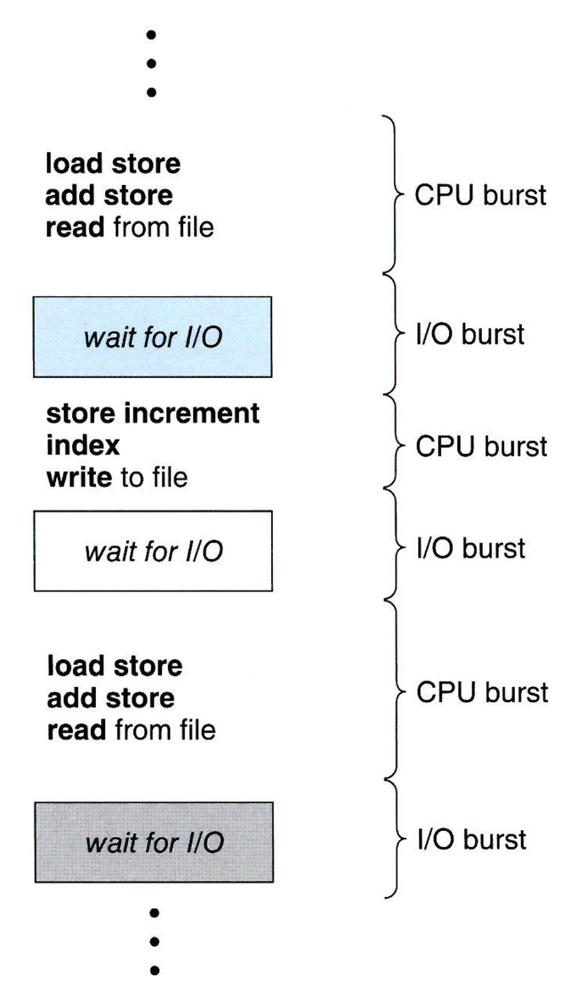

# CPU 스케쥴링

# 1. 기본 개념

- 다중 프로그래밍의 목적 : CPU 이용율 최대화 ( 항상 실행 중인 프로세스가 있다 )
- CPU 스케쥴링은 운영체제 설계의 핵심

## 1-1. CPU - I/O 버스트 사이클

- 프로세스 실행은 CPU 실행, I/O 대기의 사이클로 구성 ( 두 상태를 교대로 왔다 갔다 한다 )
- CPU 버스트들은 짧은 것이 일반적 ( CPU 지향 프로그램은 다수의 긴 CPU 버스트를 가질 수 있음 )

## 1-2. CPU 스케쥴러

- CPU 가 유휴 상태가 될 때마다 운영체제는 준비 큐에 있는 프로세스 중에서 하나를 선택해 실행 ( 실행 준비가 되어 있는 메모리 내의 프로세스 )
    - 준비 큐는 FIFO 방식의 큐가 아니어도 된다. ( 우선 순위 큐, 트리, 연결 리스트 … )
    - 준비 큐에 있는 모든 프로세스는 CPU 에서 실행될 기회를 기다리며 대기
        - 큐에 있는 레코드들은 일반적으로 PCB

</img>

## 1-3. 선점 및 비선점 스케줄링

- CPU 결정이 발생하는 4가지 상황
    1. 프로세스가 실행 → 대기 상태로 전환될 때 ( I/O 요청, 자식 프로세스의 종료를 기다릴 때 )
    2. 프로세스가 실행 → 준비 완료 상태로 전환될 때 ( 인터럽트 발생 )
    3. 프로세스가 대기 → 준비 완료 상태로 전환될 때 ( I/O 작업 완료 )
    4. 프로세스가 종료할 때
- 비선점 스케줄링 ( 1, 4 번 상황 )
    - 프로세스가 CPU를 할당받으면 프로세스 종료, 대기 상태 전환으로 인해 CPU 를 방출할 때까지 점유한다. ( 실행을 위해 새로운 프로세스가 선택 )
    - 비선점형 커널 : 컨텍스트 스위칭 이전에 시스템 콜이나 I/O 완료를 기다리며 프로세스가 봉쇄되기를 대기
- 선점 스케줄링 ( 2, 3 번 상황 )
    - 데이터가 다수의 프로세스에 의해 공유될 때 race condition 을 초래할 수 있다.
        - 같은 데이터를 사용하는 A, B 프로세스가 있을 때 A 프로세스가 데이터를 조작 중일 때 B 프로세스가 데이터를 읽으면 일관성이 깨진다.
    - 커널 설계에 영향을 준다.
        - 시스템 콜을 처리할 동안 커널은 한 프로세스를 위한 활동 ( 중요한 커널 자료 변경 등을 포함 ) 으로 바쁠 수 있다. 변경 도중 해당 프로세스가 선점되고 동일한 구조를 읽거나 변경할 필요가 있다면 혼란이 일어난다.
    - 선점형 커널 : 공유 커널 데이터 구조에 액세스할 때 race condition 을 방지하기 위해 락 기법이 필요하다
- 인터럽트에 의해서 영향을 받는 코드는 동시성을 위해 처리 필요
    - 인터럽트를 받아들이는 코드 부분은 다수 프로세스가 병행으로 접근할 수 없도록 ( 입력을 잃어버리거나 출력이 겹침 ) 진입점에서 인터럽트를 불능화, 출구에서 인터럽트를 다시 가능화
        - 불능화는 자주 발생하면 안되고 아주 적은 수의 명령어들만 포함

## 1-4. 디스패처

- 디스패처는 CPU 코어의 제어를 CPU 스케줄러가 선택한 프로세스에 주는 모듈이다.
    - 한 프로세스에서 다른 프로세스로의 context switching
        - Linux : `vmstat` 명령어로 context switching 횟수 조회 가능
        - Linux : `cat /proc/{pid}/status` 에서 ctxt_switchtes 로 확인 가능
    - 사용자 모드로 전환 ( mode bit 전환 )
    - 프로그램을 다시 시작하기 위해 프로그램의 적절한 위치로 이동하는 일 ( Jump )
- 디스패처는 가능한 한 최고로 빨리 수행되어야 한다.
- 디스패치 지연 : 하나의 프로세스를 정지하고 다른 프로세스의 수행을 시작하는 데까지 소요되는 시간

# 2. 스케줄링 기준

- 여러 CPU 스케줄링 알고리즘들은 서로 다른 특성을 가진다.  ( 일정 부류의 프로세스들을 더 선호할 수 있음 )
- 스케줄링 알고리즘을 비교하기 위한 여러 기준
    - CPU 이용률
        - 최대한 CPU 를 바쁘게 유지하는 것이 좋음 ( 40% ~ 90% )
    - 처리량 ( throughput )
        - 단위 시간당 완료된 프로세스의 개수를 세는 경우도 있음
        - 프로세스의 실행 길이에 영향을 받음
    - 총처리 시간 ( turnaround time )
        - 프로세스를 실행하는데 소요된 시간
        - 프로세스 완료 시간 - 프로세스 제출 시간
            - ( CPU 에서 실행된 시간 ) +  ( I/O 시간 ) + ( 준비 큐 대기시간 )
    - 대기 시간
        - 준비 큐 대기시간의 총합
        - 스케줄링 알고리즘은 프로세스가 준비 큐에서 대기하는 시간의 양에만 영향을 줌 ( 실행, I/O 시간에는 영향을 주지 않음 )
    - 응답 시간
        - 요구에 대한 첫번째 응답이 시작되는데까지 걸리는 시간 ( 응답 출력하는데 걸리는 시간이 아님 )
        - 대화식 시스템에서 총처리 시간이 최선의 기준이 아닐 수 있음
            - 결과가 사용자에게 출력되는 사이에 새로운 결과를 위해 연산을 계속하는 경우가 있음
            - UX 를 위해 최대 응답 시간을 최소화하고 응답 시간의 편차를 최소하는 것이 중요
- 최대화할 기준 : CPU 이용률, 처리량
- 최소화할 기준 : 총 처리시간, 대기 시간, 응답 시간
- 대부분 평균 측정 시간을 최적화하려 하지만 최솟값, 최대값을 최적하는 것이 바람직할 수도 있음

# 3. 스케줄링 알고리즘

- 준비 큐에 있는 어느 프로세스에 CPU 코어를 할당할 것인지를 결정

## 3-1. 선입 선처리 스케줄링

- FCFS : First-come, First-Served Scheduling
- CPU 를 먼저 요청하는 프로세스가 CPU 를 먼저 할당받는다. ( FIFO 큐로 관리 )
- 비선점형 스케줄링이기에 한 프로세스가 CPU 를 오래동안 점유할 수 있음
    - 짧은 프로세스들이 먼저 처리되도록 허용될 때 보다 CPU, 장치 이용률이 저하
- 최소 평균대기 시간을 가지지 않음
    - 예시
        - A : 실행시간 24
        - B : 실행시간 3
        - C : 실행시간 3
        - A , B, C 순으로 요청할 때 평균 대기 시간 : ( 0 + 24 + 27 ) / 3
        - C, B, A 순으로 요청할 때 평균 대기 시간 : ( 0 + 3 + 6 ) / 3
- 프로세스 CPU 버스트 시간에 따라 평균 대기 시간이 매우 많이 변할 수 있음

## 3-2. 최단 작업 우선 스케줄링

- SJF : Shortest-Job-First Scheduling
- shortest-next-CPU-burst : 최단 다음 CPU 버스트 알고리즘
    - 프로세스의 전체 길이가 아닌 다음 CPU 버스트 길이에 의해 스케줄링
- 각 프로세스에 다음 CPU 버스트 길이를 연관시킨 뒤 가장 작은 길이를 가진 프로세스에게 할당
    - 동일한 길이를 가질 경우 순위를 정하기 위해 FCFS 스케줄링을 적용
    - 다음 CPU 버스트의 길이를 알 수가 없기에 CPU 스케줄링 수준에서 구현할 수 없음
        - 이전 버스트의 길이와 비슷할 것이라 예상하여 예측
- 주어진 프로세스 집합에 대해 최소의 평균대기 시간을 가지는 것을 보장한다.
- 선점형이거나 비선점형일 수 있다.
    - 선점형 SJF
        - 현재 실행중인 프로세스보다 짧은 CPU 버스트를 가진 프로세스가 준비 큐에 도착시 선점한다.
        - 최소 잔여 시간 우선 스케쥴링이라고도 불린다.
    - 비선점형 SJF
        - 현재 실행중인 프로세스보다 짧은 CPU 버스트를 가진 프로세스가 준비 큐에 도착시 실행중인 프로세스가 CPU 버스트를 끝내도록 허용한다

## 3-3. 라운드 로빈 스케줄링

- FCFS 스케줄링과 유사하지만 시스템이 프로세스들 사이를 옮겨 다닐 수 있도록 선점이 추가
- 시간 할당량이나 타임슬라이스라고 하는 작은 단위의 시간을 정의
    - 일반적으로 10 ~ 100 밀리초
- 원형 큐로 동작하며 한번에 한 프로세스에 한번의 시간 할당량 동안 CPU 를 할당
- timer 를 사용하여서 시간 할당량 이후 인터럽트를 걸도록 한 뒤 프로세스를 디스패치
    - 실행 가능한 프로세스가 1개가 아니 경우 연속적으로 두번 이상의 디스패치되는 프로세스는 없다.
- 시간 할당량의 크기에 매우 많은 영향을 받는다
    - 시간 할당량이 너무 크면 FCFS 와 동일
    - 시간 할당량이 너무 작으면 context switching 이 너무 자주 발생
        - context switching 시간 ( 보통 10 마이크로초 미만 ) 보다 시간 할당량이 커야 한다.
    - 총처리 시간
        - 시간 할당량의 크기가 클수록 반드시 평균 총처리 시간이 개선으로 이어지지 않는다
            - 단일 시간 할당량 안에 다음 CPU 버스트를 끝내면 평균 총처리 시간은 개선된다
                - 시간 할당량이 작을 수록 context switching 시간이 추가되기 때문에

## 3-4. 우선순위 스케줄링

- 각 프로세스들에 우선순위가 연관되어 있음 ( SJF 도 포함 )
- CPU 는 가장 높은 우선순위를 가진 프로세스에게 할당된다.
    - 우선순위가 같은 경우 FCFS 순서로 스케줄
- 우선순위는 0 ~ 일정 범위의 수를 사용
    - 시스템마다 낮은 값이 의미하는 바는 다를 수 있음 ( 높은 우선순위, 낮은 우선순위 )
- 내부적 정의 우선 순위
    - 시간 제한
    - 메모리 요구
    - 열린 파일의 수
    - 평균 I/O 버스트의 평균 CPU 버스트에 대한 비율
    - …
- 외부적 우선 순위
    - 프로세스의 중요성
    - 컴퓨터 사용을 위해 지불되는 비요의 유형, 양
    - …
- 선점형이거나 비선점형일 수 있음
- 주요 문제
    - 무한 봉쇄 or 기아 상태
        - 실행 준비가 되었으나 CPU 를 사용하지 못하는 프로세스가 생긴다.
        - 낮은 우선순위 프로세스들이 무한 대기
        - 해결법
            - aging
                - 대기하는 프로세스의 우선순위를 점진적을 증가
            - RR 과 결합하여 사용 ( 비선점형이여 가능할 것으로 보임 )
                - 우선 순위가 높은 프로세스를 실행하고 우선순위가 같은 프로세스들은 RR 로 스케쥴링

## 3-5. 다단계 큐 스케줄링

- 여러개의 큐를 가지는 스케줄링
- 우선순위, RR 은 모든 프로세스가 단일 큐에 배치된다.
    - 큐의 관리 방식에 따라 O(n) 검색이 필요
- 응답시간 요구사항에 따라 스케줄링을 다르게 가져갈 수 있다.
- 큐와 큐 사이에 스케줄링 필요
    - 고정 우선순의 선점형 스케줄링
    - 큐들 사이에 시간을 나누어 사용 ( 큐 별로 할당받는 시간을 다르게 한다 )
        - 각 큐는 할당받은 CPU 시간을 사용해 큐에 있는 프로세스를 스케줄한다.
- 사용 예시
    - 프로세스 유형에 따라 프로세스를 별도의 큐로 분할 할 때
    - 우선 순위와 RR 이 결합된 방식
        - 우선순위별로 큐를 갖고 별도의 큐에서 RR 스케쥴링

## 3-6. 다단계 피드백 큐 스케줄링

- 다단계 큐 스케쥴링에서 프로세스가 여러 큐들 사이를 이동하는 것을 허용
    - 다단계 큐 스케줄링은 일반적으로 프로세스들이 시스템 진입 시 영구적으로 하나의 큐에 할당
        - 스케줄링 오버헤드가 적음
        - 유연하지 않음
- 사용 예시
    - CPU 시간을 너무 많이 사용시 낮은 우선순위의 큐로 이동
        - 큐에 할당된 시간안에 끝나지 않으면 낮은 우선 순위로 이동하는 방식을 방복
    - 너무 오래 대기하는 프로세스를 높은 우선순위의 큐로 이동 ( 기아 상태 예방 )
- 사용하는 매개변수
    - 큐의 개수
    - 각 큐의 스케줄링 알고리즘
    - 프로세스가 들어갈 큐를 결정하는 방식
    - 프로세스를 높은 우선순위 큐 이동 결정 방식
    - 프로세스를 낮은 우선순위 큐 이동 결정 방식

# 4. 스레드 스케쥴링

- 최신 운영체제에서 스케줄 되는 대상은 프로세스가 아니라 커널 수준 스레드이다.
- 사용자 수준 스레드는 스레드 라이브러리에 의해 관리되고 커널은 존재를 알지 못함
    - 사용자수준 스레드는 궁극적으로 연관된 커널 수준 스레드에 사상되어야 함

## 4-1. 경쟁 범위 ( Contention Scope )

- 프로세스 경쟁 범위 : 동일한 프로세스에 속한 스레드들 사이에서 CPU 경쟁
    - 다대일, 다대다 모델을 구현하는 시스템에서 스레드 라이브러리의 LWP 상에서의 스케줄
        - LWP 상에서의 스케줄은 실제 실행 중을 의미하지 않음
    - 전형적으로 우선순위에 따라 행해짐
        - 가장 높은 우선순위를 가진 실행 가능한 프로세스 선택 ??? ( 230p 마지막 문단 이상함 )
- 시스템 경쟁 범위 : 커널 스레드를 사이에서 CPU 코어 경쟁

## 4-2. Pthread 스케줄링

- PTHREAD SCOPE PROCESS : PCS 스케줄링을 사용하여 스케줄
    - LWP 의 개수는 스레드 라이브러리에 의해 유지
- PTHREAD SCOPE SYSTEM : SCS 스케줄링 사용하여 스케줄
    - 다대다 시스템 : 사용자 수준 스레드를 LWP를 생성하여 바인드 ( 결과적으로 일대일 모델 )

# 5. 다중 처리기 스케줄링

- 다중 처리기 : 여러 개의 물리적 프로세서를 제공하는 시스템
    - 다중 코어 CPU
    - 다중 스레드 코어
    - …

## 5-1. 다중 처리기 스케줄링에 대한 접근법

1. 비대칭 다중 처리
    - 하나의 코어만 시스템 자료구조에 접근
        - 마스터 처리기 : 모든 스케줄링 결정, I/O 처리, 시스템 활동을 취급
        - 나머지 처리기 : 사용자 코드 수행
    - 마스터 처리기가 전체 시스템 성능을 저하할 수 있는 병목이 된다.
2. 대칭 다중 처리 ( SMP - symmetric multi-processing )
    - 거의 모든 최신 운영체제가 지원하는 방식
    - 각 프로세서의 스케줄러가 준비 큐를 검사하고 실행할 스레드를 선택하여 스케줄링
    - 스케줄 대상 스레드 관리 전략
        - 모든 스레드가 공통 준비 큐에 존재 ( race condition 발생 )
        - 프로세서가 자신만이 스레드 큐를 가짐 ( 일반적인 접근 방식 )
            - 캐시 메모리를 효율적으로 사용할 수 있음
            - 프로세서 간의 부하의 양이 다를 수 있다. ( 균형 알고리즘 사용 필요 )

## 5-2. 다중 코어 프로세서

- 물리적 칩안에 여러개의 처리 코어를 장착하나 운영체제 입장에서는 개별적인 논리적 CPU 로 인식
    - 각 CPU 가 물리 칩을 가지는 시스템과 비교해 속도가 빠르고 적은 전력 소모
- Memory stall
    - 프로세서가 메모리에 접근할 때 데이터가 가용해지기를 기다리면서 많은 시간 낭비
        - 프로세서가 메모리보다 빠른 속도로 작동하기 때문
    - 캐시 미스로 인한 메모리 스톨도 존재
    
    </img>
    
- Memory stall 해결을 위해서 다중 스레드 처리 코어를 구현
    - 하나의 코어에 2개 이상의 하드웨어 스레드가 할당
        - 하드웨어 스레드는 명령어 포인터 및 레지스터 집합과 같은 구조적 상태를 유지하기에 스레드를 실행할 수있는 논리적 CPU 로 인식
            
            </img>
            
        - 처리 코어는 한번에 하나의 하드웨어 스레드만 실행
            - 물리적 코어의 자원을 스레드 간에 공유하기 때문 ( 캐시, 파이프 라인 )
    - 메모리를 기다리는 동안 하나의 하드웨어 스레드가 중단시 다른 스레드로 전환
    
    </img>
    
    - 이중 스레드 처리 코어 스케줄링 2단계
        1. 운영체제가 각 하드웨어 스레드에서 소프트웨어 스레드를 결정하는 스케줄링 결정
            - 두개의 소프트웨어 스레드가 하나의 코어에서 실행되도록 스케줄 되면 코어의 자원을 공유하기에 느림
            - 운영체제가 프로세서 자원 공유 수준을 알면 공유하지 않는 논리 프로세서들에게 스케줄할 수 있음
        2. 각 코어가 실행할 하드웨어 스레드를 결정하는 스케줄링 결정

## 5-3. 부하 균등화

- 부하를 모든 처리기에 균등하게 배분하는 것이 중요
- 실행할 스레드를 위한 자신 만의 준비 큐를 가지고 있는 시스템에서 필요한 기능
- 방식 ( 방식끼리 상호 배타적일 필요 없음 )
    1. push migration : 주기적으로 처리기의 부하를 검사하여 안 바쁜 처리기로 스레드 push
    2. pull migration : 쉬고 있는 처리기가 바쁜 처리기를 기다리는 프로세스를 pull

## 5-4. 처리기 선호도 ( 왜 5-2 ?? )

- SMP 지원 운영체제에서 스레드를 지속하여 같은 프로세서에서 실행시켜 warn cache 를 이용하려고 하는 것으로 현재 실행 중인 프로세서에 대한 선호도를 보임
    - 스레드가 다른 처리기로 이주할 경우 캐시 메모리는 무효화, 캐시를 다시 채우는 비용이 높은 작업이 필요함
- 선호도 종류 ( 상호 배제적이지 않음 )
    1. 강한 선호도 : 동일 처리기에서 프로세스가 처리됨을 보장
        - Linux : 시스템 콜을 통해 실행될 처리기 집합 명시
    2. 약한 선호도 : 노력은 하지만 보장하지 않음

## 5-5. 이기종 다중 처리 ( HMP )

- 작업의 특정 요구에 따라 특정 코어에 작업을 할당하여 전력 소비를 잘하기 위함
    - 일부 속도와 전력 관리 측면에서 차이가 나는 코어를 사용
    - 비대칭 다중 처리 형태가 아님
- 백그라운드 작업과 같은 긴 시간 실행해야 하는 작업을 적은 에너지를 사용하는 코어에 할당
- 적인 에너지를 사용하는 코어만 이용하게 할 수 있음 ( 절전 모드 )
- Window 10 은 스레드가 전원 관리 요구를 가장 잘 지원하는 스케줄링 정책을 선택 가능

# 6. 실시간 CPU 스케줄링

- soft 실시간 시스템
    - 중요 프로세스가 덜 중요한 프로세스들에 비해 우선권을 가지는 것만 보장
    - 프로세스가 스케줄 되는 시점에 대한 아무런 보장이 없음
- hard 실시간 시스템
    - 반드시 마감시간까지 서비스를 받아야 함
    - 마감시간이 지난 이후 서비스를 받는 것은 서비스를 전혀 받지 않는 것과 동일

## 6-1. 지연시간 최소화

- 시스템은 일반적으로 실시간으로 발생하는 이벤트를 기다리고 가능한 빨리 응답하고 그에 맞는 동작을 수행
    - 이벤트 지연시간 : 이벤트 발생부터 이벤트에 해당하는 서비스가 수행될때까지의 시간
- 실시간 시스템의 성능을 좌우하는 두가지 지연시간
    1. 인터럽트 지연시간 
        - 인터럽트가 발생한 시점부터 인터럽트 처리 루틴이 시작하기까지의 시간
            - 수행중인 프로세스의 상태를 저장해 놓는 시간이 포함되어 있음
        - hard 실시간 시스템에서 정해진 시간보다 작아야하고 최소로 해야함
        - 인터럽트 불능 시간 : 커널 데이터 구조체를 갱신하는 시간
        
        </img>
        
    2. 디스패치 지연시간
        - 스케줄링 디스패처가 하나의 프로세스를 블록시키고 다른 프로세스를 시작하는 데까지 걸리는 시간
        - CPU 를 즉시 사용해야하는 경우 이 지연시간을 최소화해야 함
        - 선점형 커널을 사용하는 것이 효과적
        
        </img>
        
        - 충돌
            1. 커널에서 동작하는 프로세스에 대한 선점
            2. 높은 우선순위의 프로세스가 필요한 자원을 낮은 우선순위 프로세스 자원이 방출
        - 디스패치 : 우선순위가 높은 프로세스를 사용가능한 CPU 에 스케줄

## 6-2. 우선순위 기반 스케줄링

- 실시간 운영체제에서 가장 중요한 것은 실시간 프로세스가 CPU 가 필요할 때 바로 응답하는 것
    - 선점을 이용한 우선순위 기반의 알고리즘을 지원해야 함
- hard 실시간 시스템에서는 마감시간 이내에 수행되어야 하기에 부가적인 스케줄링 기법이 필요함

### Hard 실시간 시스템 스케줄링

- 마감시간 이내에 수행되도록 스케줄링
- 스케줄링 될 프로세스의 특징
    - 일정한 간격으로 CPU 가 필요한 프로세스 ( 주기 프로세스 )
        - P : 주기
        - T : CPU 사용권을 얻었을 때마다 고정된 수행 시간
        - D : CPU 로 부터 반드시 서비스를 받야하는 하는 마감시간
        - 0 ≤ T ≤ D ≤  P
        - 주기 태스크의 실행 빈도 : 1 / P
- 스케줄러는 마감시간과 주기적 프로세스의 실행 빈도에 따라서 우선순위를 정함
- 승인 제어 알고리즘을 이용해 마감시간 이내에 완수할 수 있는 프로세스만 실행을 허락
- 프로세스가 자신의 마감시간을 스케줄러에게 알려야 할 수 도 있음 ( 일반적이지 않음 )

## 6-3. Rate-monotomic 스케줄링

- 주기가 짧은 태스크가 높은 우선순위를 가진다 ( CPU 를 더 자주 필요로 하는 태스크 )
- CPU 최대화해서 사용하는 것은 불가능
- 수행 가능 예시
    
    |  | 주기  | 수행시간 |
    | --- | --- | --- |
    | P1 | 50 | 20 |
    | P2 | 100 | 35 |
    
    </img>
    
- 수행 불가능 예시
    
    |  | 주기  | 수행시간 |
    | --- | --- | --- |
    | P1 | 50 | 25 |
    | P2 | 80 | 35 |
    
    </img>
    

## 6-4. Earliest-Deadline-First 스케줄링

- 마감시간에 따라서 우선순위를 동적으로 부여
- 예시

    |  | 주기  | 수행시간 |
    | --- | --- | --- |
    | P1 | 50 | 25 |
    | P2 | 80 | 35 |

</img>

- 시간 별 우선 순위

    | 시간 | P1 마감시간 | P2 마감시간 | 우선 순위 |
    | --- | --- | --- | --- |
    | 0 ~ 50 | 50 | 80 | P1 |
    | 50 ~ 80 | 100 | 80 | P2 |
    | 80 ~ 100 | 100 | 160 | P1 |
    | 100 ~ 150 | 150 | 160 | P1 |
    | 150 ~ 160 | 200 | 160 | P2 |

## 6-5 일정 비율의 몫 스케줄일

- 모든 응용들에게 T 개의 시간 몫을 할당하여 동작
- 예시 ( T = 100 )
    - A 에게 50 ( 처리기 시간의 `50 / 100` 퍼센트 할당 )
    - B 에게 15 ( 처리기 시간의 `15 / 100` 퍼센트 할당 )
    - C 에게 20 ( 처리기 시간의 `50 / 100` 퍼센트 할당 )
